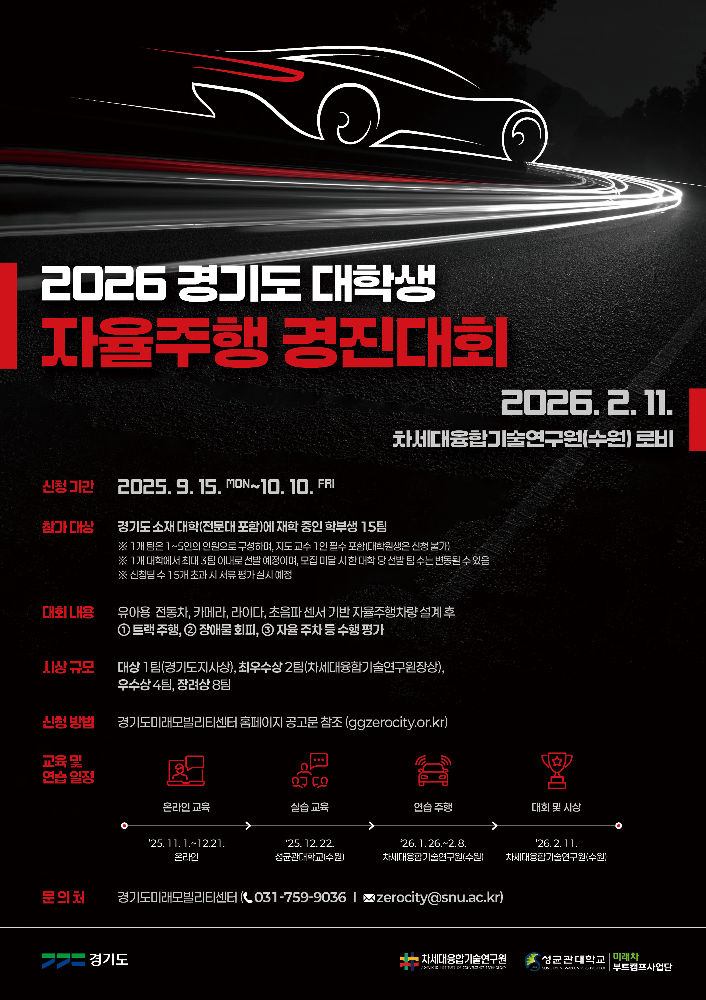

<div align="center">

# Gyeonggi AD Challenge 2026

### Autonomous Driving Repository

Vision-based lane following, traffic-light awareness, and LiDAR obstacle avoidance built for a
2026 autonomous driving competition project.

<br />



<br />
<br />


</div>

---

## Overview

This repository contains our competition pipeline for a small-scale autonomous vehicle built around
real-time perception and control. The project is split into two driving modes:

- `Speed Drive` focuses on lane following with YOLO segmentation, BEV transformation, and sliding-window tracking.
- `Mission Drive` extends the lane-following pipeline with traffic-light recognition, end-zone detection, and LiDAR-based obstacle avoidance.
- `Collect` stores the data-capture workflow used to record raw driving images and steering labels for training.

The code is practical and hardware-oriented: cameras, serial communication, model inference, and control all live in the same runtime loop.

---

## Core Capabilities

### Lane Following

- YOLO segmentation separates left and right lane regions.
- A bird's-eye-view transform stabilizes lane geometry before control.
- A sliding-window tracker estimates lane center even when one side is partially missing.
- Smoothed steering reduces sudden control spikes during runtime.

### Traffic-Light Handling

- `Mission Drive` uses a dedicated YOLO model for signal-state recognition.
- Red and green masks are counted directly from inference output.
- The vehicle stops and restarts according to the detected mission state.

### Obstacle Avoidance

- `RPLidar` scans the forward sector for near obstacles.
- When an obstacle is detected inside the safety range, the controller triggers a lane-change command.
- After the avoidance phase, the system returns to straight driving and resumes normal lane tracking.

### Data Collection

- The collection script records raw camera frames and steering labels in sync.
- Based on the current repository snapshot, `Collect/data/labels.csv` contains 63,792 labeled entries.
- This makes the repository more than just inference code; it also preserves part of the training workflow.

---

## Project Layout

```text
Gyeonggi-AD-Challenge-2026/
|- Collect/
|  |- 01_collect_data.py
|  |- data/
|     |- images/
|     |- labels.csv
|- Mission Drive/
|  |- main.py
|  |- Function_Library.py
|  |- mission2/weights/
|  |- train2/
|- Speed Drive/
|  |- main.py
|  |- bev.py
|  |- mission1.py
|  |- mission2.py
|  |- auto_label.py
|  |- labelme_to_yolo_seg.py
|  |- train4/
`- README.md
```

---

## Pipeline Snapshot

```text
Camera / LiDAR Input
        |
        v
YOLO Segmentation / Signal Detection
        |
        v
BEV Transform + Lane Center Estimation
        |
        v
Steering / Speed Decision
        |
        v
Arduino Serial Command
```

---

## Visual Results

### Lane Segmentation Validation

<div align="center">
  
</div>

### Traffic-Light Detection Validation

<div align="center">
  
</div>

### Training Curves

<div align="center">
  
</div>

These figures come directly from the repository's saved training outputs and validation batches.

---

## Runtime Notes

The current codebase is tuned for a Windows-based local setup with fixed device indices and serial ports.

- `Speed Drive/main.py` uses `COM10` and a single camera.
- `Mission Drive/main.py` uses `COM5`, `COM7`, and two USB cameras.
- Both pipelines assume `640x480` input resolution.
- `Mission Drive` includes local weight paths and selects CUDA automatically when available through PyTorch.
- `Speed Drive` currently points to `runs/segment/mission1/weights/best.pt` and hardcodes CUDA usage, so it may require a local path update before it runs in a fresh clone.

Before running the code on another machine, adjust serial ports, camera indices, and hardware connections to match your environment.

---

## Quick Start

### 1. Install dependencies

```bash
pip install ultralytics opencv-python numpy pyserial rplidar-roboticia torch pygame pandas
```

### 2. Run Speed Drive

```bash
cd "Speed Drive"
python main.py
```

Note: in the current snapshot, `Speed Drive/main.py` references a model path under `runs/segment/mission1/weights/best.pt`, while committed training artifacts are stored under `Speed Drive/train4/`. You may need to update the model path and CUDA settings before running it on another machine.

### 3. Run Mission Drive

```bash
cd "Mission Drive"
python main.py
```

### 4. Collect driving data

```bash
cd Collect
python 01_collect_data.py
```

Note: the collection script imports `utils.config`, so the local collection environment may include additional files or configuration outside the current repository snapshot.

---

## Technical Highlights

- Lane-center estimation is computed from independent left/right masks rather than a single merged region.
- The controller includes smoothing, deadzone handling, and lane-width recovery logic.
- `Mission Drive` combines three perception tasks in one loop: lane following, traffic-light response, and obstacle avoidance.
- The repository keeps both code and generated training artifacts together, making the development process easier to inspect.

---

## Team

This project was developed by a five-member team.

| Role | Name |
| --- | --- |
| Team Leader | Hong Sunghyun |
| Member | Park Gyuhyeon |
| Member | Song Seonghyeok |
| Member | Lim Songju |
| Member | Park Yonghui |

---

## Award

This project received the Encouragement Prize in the competition.

---

## Repository Status

This README reflects the current public snapshot of the repository. It documents the code and artifacts that are already included here, without assuming unpublished hardware specs, team metadata, or competition results.
